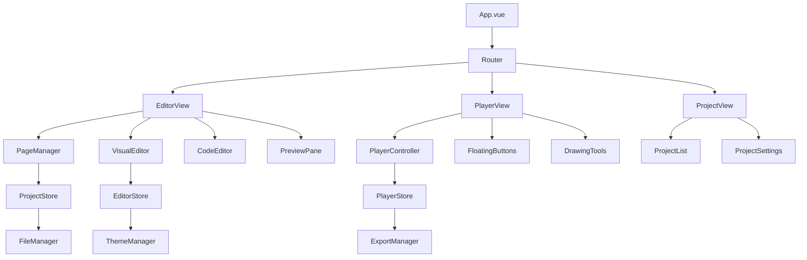

# Design Document

## Overview

HTML PPT编辑器是一个基于Vue.js 3 + TypeScript的现代化Web应用程序，采用组件化架构设计。该系统通过模块化的方式实现了项目管理、双模式编辑、实时预览、全屏播放和多平台导出等核心功能。整体架构遵循单一职责原则和依赖注入模式，确保代码的可维护性和可扩展性。

## Steering Document Alignment

### Technical Standards (tech.md)
由于这是新项目，将建立以下技术标准：
- **TypeScript严格模式**: 所有代码使用TypeScript并启用严格类型检查
- **Vue 3 Composition API**: 统一使用Composition API进行组件开发
- **Pinia状态管理**: 使用Pinia进行全局状态管理
- **ESLint + Prettier**: 统一代码风格和质量检查

### Project Structure (structure.md)
项目将采用标准的Vue.js项目结构，按功能模块组织代码：
- `src/components/`: 按功能分组的Vue组件
- `src/stores/`: Pinia状态管理模块
- `src/utils/`: 工具函数和帮助类
- `src/types/`: TypeScript类型定义

## Code Reuse Analysis

### Existing Components to Leverage
- **Vue.js 3 Core**: 利用Vue 3的响应式系统和组件生命周期
- **Element Plus**: UI组件库，提供统一的界面组件
- **GrapesJS**: 可视化编辑器，提供拖拽式页面构建功能
- **Monaco Editor**: 代码编辑器，提供语法高亮和智能补全

### Integration Points
- **Electron**: 用于桌面应用打包和多平台导出
- **File System API**: 用于项目文件的读写操作
- **Browser Storage**: 用于临时数据和用户偏好设置

## Architecture

系统采用分层架构设计，包含表示层、业务逻辑层和数据访问层。使用事件总线模式进行组件间通信，依赖注入模式管理服务依赖。

### Modular Design Principles
- **Single File Responsibility**: 每个Vue组件文件只负责一个特定功能
- **Component Isolation**: 创建小而专注的组件，避免大型单体文件
- **Service Layer Separation**: 分离数据访问、业务逻辑和表示层
- **Utility Modularity**: 将工具函数分解为专注的单一用途模块



## Components and Interfaces

### ProjectManager
- **Purpose:** 管理PPT项目的创建、打开、保存和页面操作
- **Interfaces:**
  - `createProject(name: string): Promise<Project>`
  - `openProject(path: string): Promise<Project>`
  - `saveProject(project: Project): Promise<void>`
  - `addPage(project: Project): Promise<Page>`
  - `deletePage(project: Project, pageId: string): Promise<void>`
- **Dependencies:** ProjectStore, FileManager
- **Reuses:** Vue 3 Composition API, Pinia

### VisualEditor
- **Purpose:** 提供GrapesJS可视化编辑功能
- **Interfaces:**
  - `initEditor(container: HTMLElement, config: EditorConfig): void`
  - `loadPage(page: Page): void`
  - `savePage(): Promise<Page>`
  - `switchTheme(theme: Theme): void`
- **Dependencies:** GrapesJS, EditorStore
- **Reuses:** GrapesJS插件系统, Element Plus组件

### CodeEditor
- **Purpose:** 提供Monaco代码编辑功能
- **Interfaces:**
  - `initEditor(container: HTMLElement, language: string): void`
  - `setValue(code: string): void`
  - `getValue(): string`
  - `formatDocument(): void`
- **Dependencies:** Monaco Editor, EditorStore
- **Reuses:** Monaco Editor API, TypeScript语言支持

### PlayerController
- **Purpose:** 控制PPT播放和全屏模式
- **Interfaces:**
  - `enterFullscreen(): void`
  - `exitFullscreen(): void`
  - `nextPage(): void`
  - `previousPage(): void`
  - `toggleDrawingTool(tool: DrawingTool): void`
- **Dependencies:** PlayerStore, FloatingButtons, DrawingTools
- **Reuses:** Fullscreen API, Canvas API

### FloatingButtons
- **Purpose:** 管理全屏模式下的悬浮翻页按钮
- **Interfaces:**
  - `show(position: 'left' | 'right'): void`
  - `hide(): void`
  - `updateConfig(config: FloatingButtonConfig): void`
  - `bindEvents(): void`
- **Dependencies:** PlayerStore
- **Reuses:** CSS定位, 事件监听

### ExportManager
- **Purpose:** 处理多平台导出功能
- **Interfaces:**
  - `exportToWindows(project: Project): Promise<string>`
  - `exportToMacOS(project: Project): Promise<string>`
  - `exportToLinux(project: Project): Promise<string>`
- **Dependencies:** Electron, FileManager
- **Reuses:** Electron打包API, 文件系统操作

## Data Models

### Project
```typescript
interface Project {
  id: string;
  name: string;
  description?: string;
  createdAt: Date;
  updatedAt: Date;
  pages: Page[];
  config: ProjectConfig;
  theme: Theme;
  path: string;
}
```

### Page
```typescript
interface Page {
  id: string;
  name: string;
  order: number;
  html: string;
  css: string;
  js?: string;
  thumbnail?: string;
  createdAt: Date;
  updatedAt: Date;
}
```

### ProjectConfig
```typescript
interface ProjectConfig {
  autoSave: boolean;
  autoSaveInterval: number;
  defaultTransition: string;
  showPageNumbers: boolean;
  loopPresentation: boolean;
}
```

### Theme
```typescript
interface Theme {
  id: string;
  name: string;
  colors: {
    primary: string;
    secondary: string;
    background: string;
    text: string;
    accent: string;
  };
  fonts: {
    heading: string;
    body: string;
    code: string;
  };
  spacing: {
    small: number;
    medium: number;
    large: number;
  };
}
```

### FloatingButtonConfig
```typescript
interface FloatingButtonConfig {
  position: 'left' | 'right';
  opacity: number;
  size: 'small' | 'medium' | 'large';
  autoHide: boolean;
  showOnHover: boolean;
}
```

## Error Handling

### Error Scenarios
1. **项目文件损坏**
   - **Handling:** 自动备份恢复，提示用户重新创建
   - **User Impact:** 显示友好的错误信息，提供恢复选项

2. **编辑器初始化失败**
   - **Handling:** 降级到代码编辑模式，记录错误日志
   - **User Impact:** 通知用户编辑器遇到问题，提供替代方案

3. **导出过程失败**
   - **Handling:** 清理临时文件，提供详细错误信息
   - **User Impact:** 显示具体的失败原因和解决建议

4. **文件系统权限错误**
   - **Handling:** 引导用户选择其他目录，使用临时目录
   - **User Impact:** 解释权限问题，提供操作指引

5. **内存不足**
   - **Handling:** 自动保存进度，清理缓存，建议关闭其他页面
   - **User Impact:** 警告内存不足，提供优化建议

## Testing Strategy

### Unit Testing
- **工具函数测试**: 使用Vitest测试所有utils模块
- **组件单元测试**: 使用Vue Test Utils测试组件的独立功能
- **状态管理测试**: 测试Pinia store的actions和getters
- **类型检查**: 使用TypeScript编译器进行静态类型检查

### Integration Testing
- **编辑器集成**: 测试VisualEditor和CodeEditor的切换
- **文件操作**: 测试项目保存和加载的完整流程
- **播放器功能**: 测试全屏播放和悬浮按钮交互
- **主题系统**: 测试主题应用和切换功能

### End-to-End Testing
- **完整工作流**: 从创建项目到导出的完整用户场景
- **跨浏览器测试**: 在Chrome、Firefox、Safari、Edge上进行测试
- **性能测试**: 测试大型项目的编辑和播放性能
- **可访问性测试**: 验证键盘导航和屏幕阅读器支持